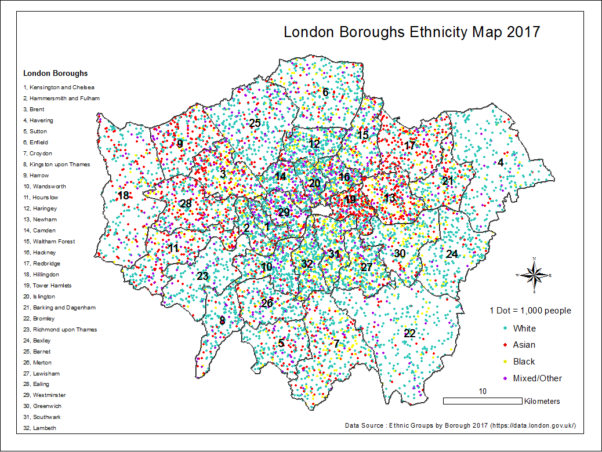
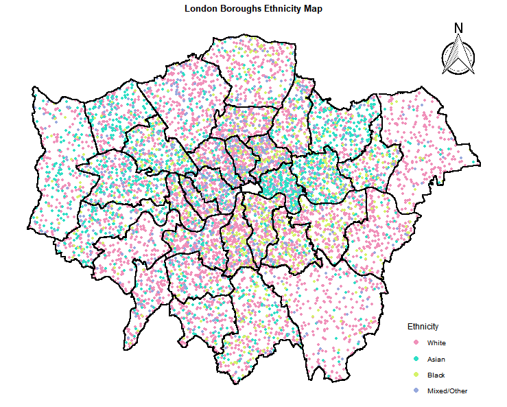

## Comparative Analysis of R and ArcMap (641 words)

The first striking difference between R and ArcMAp is that R consists of writing scripts whereas ArcMap mainly works through mouse-clicks. I found the latter to be very useful as I was able to easily zoom the map in and out, move it around with the pan, instantly displace and resize elements on the map. On the other hand, the lack of this functionality on R, caused these simple tasks to take longer to execute. For instance, to find the right layout on ArcMap, all I had to do is convert items like legend into 'Graphics' to change their sizes and move them. However in R, I had to change values of north arrow position, legend position, title position in the code, then rerun the code several times and wait each time before finding the perfect display. This required more time and many code adjustments also because, on R, the user cannot preview the outcome of the code before running it unlike ArcMap where one can instantly see the changes simply by pressing the 'Apply' button. This preview functionality was particularly helpful in my case, as I had to change dot value and dot size to get an attractive legible dot density map.  

Also I have found ArcMap to be more intuitive and hence novice-friendly. Its Graphical Interface and direct manipulation make it easier to learn in shorter time. In contrast, R requires prior knowledge of programming which results in a difficult initial learning. I personally spent twice the time on R than ArcMap because for most tasks on R I had to research and read about corresponding functions online. Also, I spent most of the time understanding and fixing errors. And when you can't solve errors, R can become daunting and frustrating.For example, I tried using 'geom_text' to add boroughs names to the map and the value of 1 dot to the legend but after many attempts I still couldn't succeed.

Moreover, luckily I have found someone in the R community who have written code to create a dot density map that I adapted. Otherwise, I don't believe, as a novice, I would have been able to produce similar code from scratch or at least it would have taken me ages and many failed attempts before doing so. This is an advantage of R; existing codes are available for anyone with similar problems or queries.  However, adapting other people's code is not an easy task as this may generate many error messages that need to be solved.   

Nevertheless, I encountered R to be superior to ArcMap in many areas. First and foremost: reproducibility. R scripts preserve and document the workflow. This makes it easily reproducible and comprehensible by others in the future. On the other hand, when we manipulate data with mouse-clicks we don't automatically keep track of our actions. Therefore, if ever there is an error we won't know at what level it exactly occurred.  

Also, data analysis and data preparation can be done on R whereas with ArcMap, data is cleaned and prepared outside the software. For example, unreadable characters needed to be deleted from the data on excel before uploading it to ArcMap. On R, one line of code was enough to do that. R permits more flexibility in manipulating data. With R I converted several factor columns to numeric ones with a single line of code, in ArcMap I had to create new empty fields of numeric type and copy the values of the fields into the new ones. Additionally, with ArcMap you're limited to the available options while R offers a wider range of functions and ever-expanding libraries and you can even develop new tools by yourself.

In conclusion, for novices and for basic GIS work, GUI software seem to be the obvious option. However, for complicated and unusual GIS projects, R is recommended.  


## Maps

### Map produced on ArcMAp

```{r Arcmap Map, echo=FALSE,fig.align="center", fig.cap="Map produced on ArcMap", out.width = '90%'}

```


### Map produced on R

```{r R Map, echo=FALSE,fig.align='center', fig.cap="Map produced on R", out.width = '90%'}

```


## Bibliography